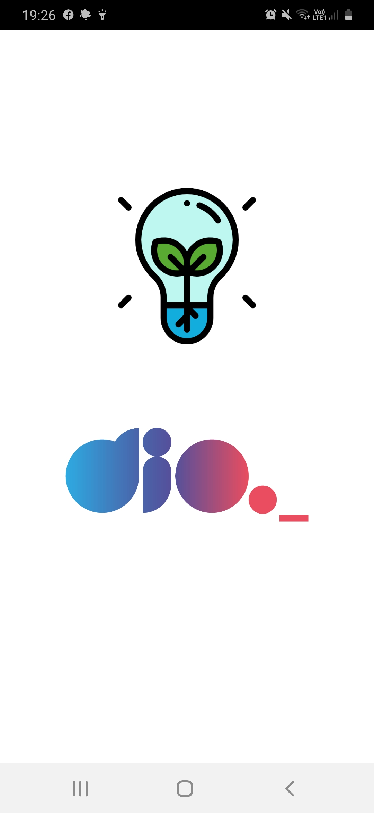
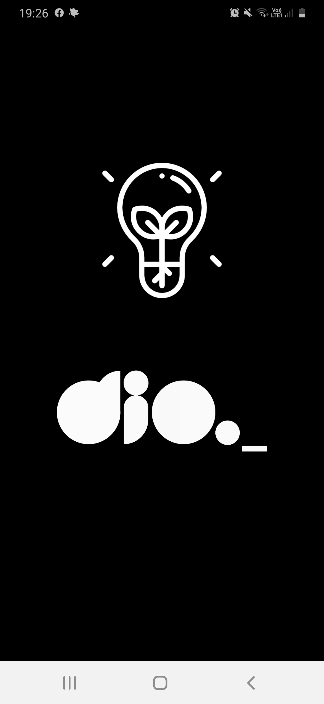

# Flashlight

## Desafio de construção de um app usando o sensor de movimento do react native

## conteúdo:

- libs react-native-torch e react-native-shake
- Stylesheet
- Hook useState
- Hook useEffect
- add listener to RNShake
- lifecicly ReactJS

